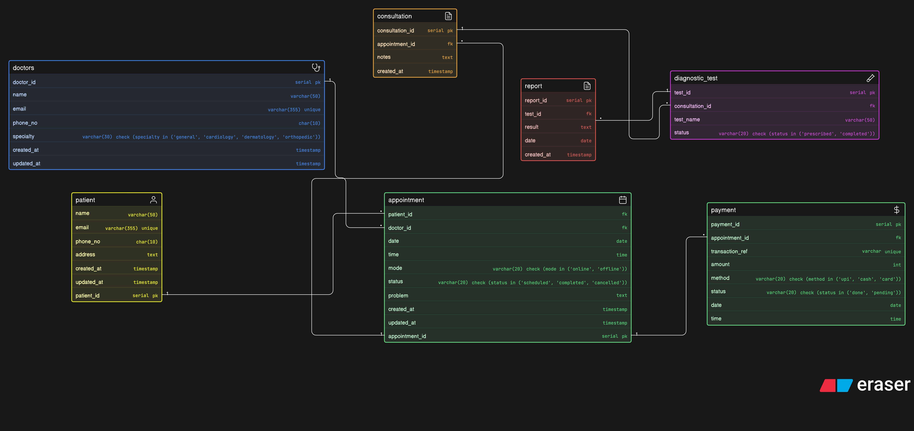

# Clinic Appointment and Diagnostics Platform – ER Diagram



This project contains an ER diagram for a clinic management system that handles appointments, consultations, diagnostic tests, reports, and payments.

## Main Entities

- `doctors`  
- `patient`  
- `appointment`  
- `consultation`  
- `diagnostic_test`  
- `report`  
- `payment`  

## Relationships

- A patient can have multiple appointments  
- A doctor can handle multiple appointments  
- An appointment may result in one consultation  
- A consultation can include multiple diagnostic tests  
- Each test can generate a report  
- Payments are linked to appointments  

## Eraser Code: 

```
doctors [icon: doctor, color: blue] {
  doctor_id serial pk
  name varchar(50)
  email varchar(355) unique
  phone_no char(10)
  specialty varchar(30) check (specialty in ('general', 'cardiology', 'dermatology', 'orthopedic'))
  created_at timestamp
  updated_at timestamp
}

patient [icon: user, color: yellow] {
  patient_id serial pk
  name varchar(50)
  email varchar(355) unique
  phone_no char(10)
  age int
  gender varchar(10) check (gender in ('male', 'female', 'other'))
  address text
  created_at timestamp
  updated_at timestamp
}

appointment [icon: calendar, color: green] {
  appointment_id serial pk
  patient_id fk
  doctor_id fk
  date date
  time time
  mode varchar(20) check (mode in ('online', 'offline'))
  status varchar(20) check (status in ('scheduled', 'completed', 'cancelled'))
  problem text
  created_at timestamp
  updated_at timestamp
}

consultation [icon: document, color: orange] {
  consultation_id serial pk
  appointment_id fk
  symptoms text
  diagnosis text
  notes text
  created_at timestamp
}

diagnostic_test [icon: test-tube, color: purple] {
  test_id serial pk
  consultation_id fk
  test_name varchar(50)
  status varchar(20) check (status in ('prescribed', 'completed'))
}

report [icon: document, color: red] {
  report_id serial pk
  test_id fk
  result text
  date date
  created_at timestamp
}

payment [icon: dollar-sign, color: green] {
  payment_id serial pk
  appointment_id fk
  transaction_ref varchar unique
  amount int
  method varchar(20) check (method in ('upi', 'cash', 'card'))
  status varchar(20) check (status in ('done', 'pending'))
  date date
  time time
}

patient.patient_id < appointment.patient_id
doctors.doctor_id < appointment.doctor_id
appointment.appointment_id < consultation.appointment_id
consultation.consultation_id < diagnostic_test.consultation_id
diagnostic_test.test_id < report.test_id
appointment.appointment_id < payment.appointment_id
```