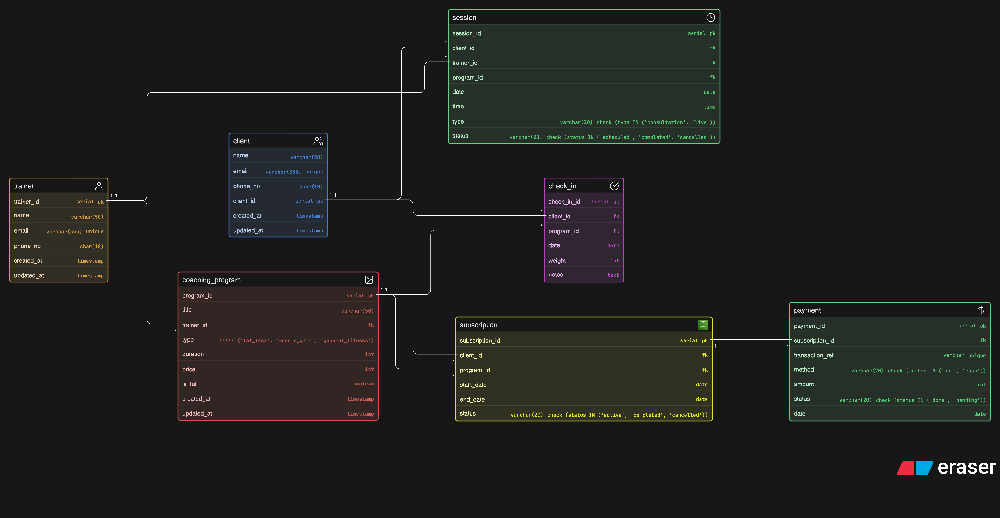

# Fitness Influencer Coaching Platform – ER Diagram

This project contains an ER diagram for an online fitness coaching platform where trainers manage clients, sell programs, schedule sessions, and track client progress.



## Main Entities

- `client`
- `trainer`
- `coaching_program`
- `subscription`
- `session`
- `check_in`
- `payment`

## Relationships

- A trainer can create multiple coaching programs
- A client can subscribe to multiple programs
- A program can have multiple client subscriptions
- Sessions are scheduled between clients and trainers
- Check-ins track client progress for a program
- Payments are linked to subscriptions

## Eraser Code:

```
client [icon: users, color: blue] {
  client_id serial pk
  name varchar(50)
  email varchar(355) unique
  phone_no char(10)
  created_at timestamp
  updated_at timestamp
}

trainer [icon: user, color: orange] {
  trainer_id serial pk
  name varchar(50)
  email varchar(355) unique
  phone_no char(10)
  created_at timestamp
  updated_at timestamp
}

coaching_program [icon: image, color: red] {
  program_id serial pk
  title varchar(50)
  trainer_id fk
  type check ('fat_loss', 'muscle_gain', 'general_fitness')
  duration int
  price int
  is_full boolean
  created_at timestamp
  updated_at timestamp
}

subscription [icon: aws-budgets, color: yellow] {
  subscription_id serial pk
  client_id fk
  program_id fk
  start_date date
  end_date date
  status varchar(20) check (status IN ('active', 'completed', 'cancelled'))
}

session [icon: timer, color: green] {
  session_id serial pk
  client_id fk
  trainer_id fk
  program_id fk
  date date
  time time
  type varchar(20) check (type IN ('consultation', 'live'))
  status varchar(20) check (status IN ('scheduled', 'completed', 'cancelled'))
}

check_in [icon: check-circle, color: purple] {
  check_in_id serial pk
  client_id fk
  program_id fk
  date date
  weight int
  notes text
}

payment [icon: dollar-sign, color: green] {
  payment_id serial pk
  subscription_id fk
  transaction_ref varchar unique
  method varchar(20) check (method IN ('upi', 'cash'))
  amount int
  status varchar(20) check (status IN ('done', 'pending'))
  date date
}

trainer.trainer_id < coaching_program.trainer_id
client.client_id < subscription.client_id
coaching_program.program_id < subscription.program_id
client.client_id < session.client_id
trainer.trainer_id < session.trainer_id
client.client_id < check_in.client_id
coaching_program.program_id < check_in.program_id
subscription.subscription_id < payment.subscription_id
 
```