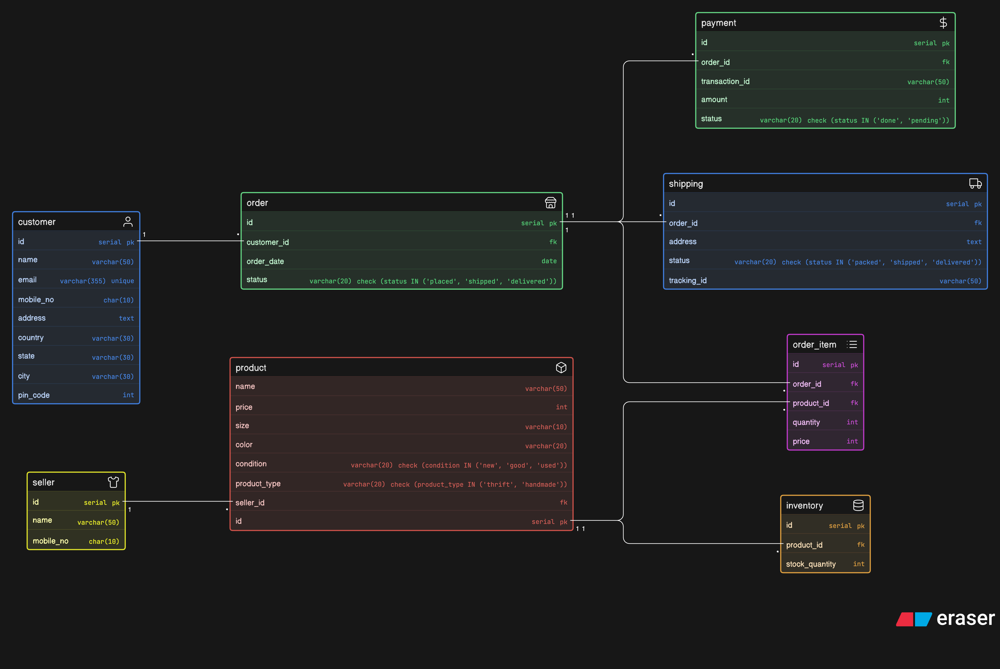

# Instagram Thrift Creator Store – ER Diagram



This project contains an DB diagram for a Instagram thrift creator store.

## Main Entities

- `customer`
- `seller`
- `product`
- `inventory`
- `order`
- `order_item`
- `payment`
- `shipping`

## Relationships

- A customer can have multiple orders
- An order can have multiple products (via `order_item`)
- A product belongs to a seller
- Each product has inventory
- Each order is linked to payment and shipping details

## Eraser Code:

```
customer [icon: user, color: blue] {
  id serial pk
  name varchar(50)
  email varchar(355) unique
  mobile_no char(10)
  address text
  country varchar(30)
  state varchar(30)
  city varchar(30)
  pin_code int
}

seller [icon: shirt, color: yellow] {
  id serial pk
  name varchar(50)
  mobile_no char(10)
}

product [icon: box, color: red] {
  id serial pk
  name varchar(50)
  price int
  size varchar(10)
  color varchar(20)
  condition varchar(20) check (condition IN ('new', 'good', 'used'))
  product_type varchar(20) check (product_type IN ('thrift', 'handmade'))
  seller_id fk
}

inventory [icon: storage, color: orange] {
  id serial pk
  product_id fk
  stock_quantity int
}

order [icon: store, color: green] {
  id serial pk
  customer_id fk
  order_date date
  status varchar(20) check (status IN ('placed', 'shipped', 'delivered'))
}

order_item [icon: list, color: purple] {
  id serial pk
  order_id fk
  product_id fk
  quantity int
  price int
}

payment [icon: dollar-sign, color: green] {
  id serial pk
  order_id fk
  transaction_id varchar(50)
  amount int
  status varchar(20) check (status IN ('done', 'pending'))
}

shipping [icon: truck, color: blue] {
  id serial pk
  order_id fk
  address text
  status varchar(20) check (status IN ('packed', 'shipped', 'delivered'))
  tracking_id varchar(50)
}

customer.id < order.customer_id
order.id < order_item.order_id
product.id < order_item.product_id
seller.id < product.seller_id
product.id < inventory.product_id
order.id < payment.order_id
order.id < shipping.order_id
```