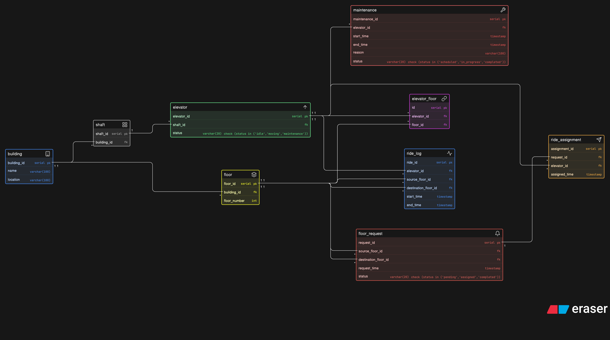

# Smart Elevator Control System – ER Diagram



This project contains an ER diagram for a smart elevator control platform used in large buildings like corporate towers, malls, and hospitals. The system manages multiple elevators, floor requests, ride assignments, maintenance, and usage tracking.


## Main Entities

- `building`  
- `floor`  
- `shaft`  
- `elevator`  
- `elevator_floor`  
- `floor_request`  
- `ride_assignment`  
- `ride_log`  
- `maintenance`  

## Relationships

- A building contains multiple floors and shafts  
- Each shaft contains one elevator  
- An elevator can serve multiple floors and a floor can be served by multiple elevators  
- Floor requests are generated from source to destination floors  
- Each request is assigned to one elevator  
- Elevators complete multiple rides over time  
- Maintenance records are linked to elevators  

## Eraser Code:

```
building [icon: building, color: blue] {
  building_id serial pk
  name varchar(100)
  location varchar(100)
}

floor [icon: layers, color: yellow] {
  floor_id serial pk
  building_id fk
  floor_number int
}

shaft [icon: grid, color: gray] {
  shaft_id serial pk
  building_id fk
}

elevator [icon: arrow-up, color: green] {
  elevator_id serial pk
  shaft_id fk
  status varchar(20) check (status in ('idle','moving','maintenance'))
}

elevator_floor [icon: link, color: purple] {
  id serial pk
  elevator_id fk
  floor_id fk
}

floor_request [icon: bell, color: red] {
  request_id serial pk
  source_floor_id fk
  destination_floor_id fk
  request_time timestamp
  status varchar(20) check (status in ('pending','assigned','completed'))
}

ride_assignment [icon: send, color: orange] {
  assignment_id serial pk
  request_id fk
  elevator_id fk
  assigned_time timestamp
}

ride_log [icon: activity, color: blue] {
  ride_id serial pk
  elevator_id fk
  source_floor_id fk
  destination_floor_id fk
  start_time timestamp
  end_time timestamp
}

maintenance [icon: tool, color: brown] {
  maintenance_id serial pk
  elevator_id fk
  start_time timestamp
  end_time timestamp
  reason varchar(100)
  status varchar(20) check (status in ('scheduled','in_progress','completed'))
}

building.building_id < floor.building_id
building.building_id < shaft.building_id
shaft.shaft_id < elevator.shaft_id
elevator.elevator_id < elevator_floor.elevator_id
floor.floor_id < elevator_floor.floor_id
floor.floor_id < floor_request.source_floor_id
floor.floor_id < floor_request.destination_floor_id
floor_request.request_id < ride_assignment.request_id
elevator.elevator_id < ride_assignment.elevator_id
elevator.elevator_id < ride_log.elevator_id
floor.floor_id < ride_log.source_floor_id
floor.floor_id < ride_log.destination_floor_id
elevator.elevator_id < maintenance.elevator_id
```